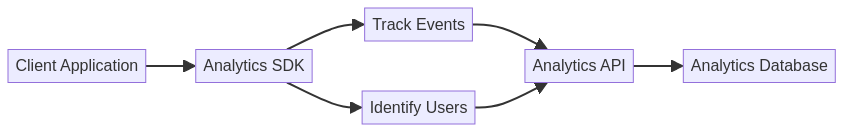

# Enterprise Analytics SDK with TypeScript


Este projeto pode ser visualizado e interagido através do GitHub Pages: [https://gabrieldemetrioslafis.github.io/typescript-enterprise-analytics-sdk/](https://gabrieldemetrioslafis.github.io/typescript-enterprise-analytics-sdk/)

This project can be viewed and interacted with via GitHub Pages: [https://gabrieldemetrioslafis.github.io/typescript-enterprise-analytics-sdk/](https://gabrieldemetrioslafis.github.io/typescript-enterprise-analytics-sdk/)

---

## 🇧🇷 SDK de Analytics Enterprise com TypeScript

Este repositório apresenta um **Software Development Kit (SDK) robusto e escalável para analytics empresarial, desenvolvido com TypeScript**. O objetivo é fornecer um conjunto de ferramentas e componentes reutilizáveis que permitam a desenvolvedores e cientistas de dados integrar capacidades analíticas avançadas em suas aplicações web e de backend. O SDK foca em **coleta de dados, processamento, visualização e integração com plataformas de analytics**, garantindo tipagem forte, manutenibilidade e alta performance.

### 🎯 Objetivo

O principal objetivo deste projeto é **fornecer um SDK completo e bem documentado** que acelere o desenvolvimento de soluções de analytics em ambientes empresariais. Serão abordados desde a arquitetura do SDK, padrões de design, exemplos de uso em diferentes contextos (frontend e backend), até a integração com APIs de dados e ferramentas de visualização.

### ✨ Destaques

- **Tipagem Forte com TypeScript**: Garante maior segurança, manutenibilidade e refatoração de código, reduzindo erros em tempo de desenvolvimento.
- **Modularidade e Reusabilidade**: Componentes bem definidos que podem ser facilmente integrados em diversas aplicações, promovendo a reutilização e padronização.
- **Performance Otimizada**: Implementações eficientes para processamento de dados e renderização de visualizações, garantindo uma experiência de usuário fluida.
- **Integração com APIs de Dados**: Exemplos de como conectar o SDK a diferentes fontes de dados e APIs para coleta e consumo de informações.
- **Visualização de Dados Interativa**: Componentes de visualização que permitem criar dashboards e relatórios dinâmicos e intuitivos.
- **Código Profissional**: Exemplos de código bem estruturados, seguindo as melhores práticas da indústria, com foco em clareza, eficiência e documentação interna.
- **Documentação Completa**: Cada módulo e componente do SDK é acompanhado de documentação detalhada, explicando seu propósito, parâmetros, lógica e exemplos de uso.
- **Testes Incluídos**: Módulos de código validados através de testes unitários e de integração, garantindo a correção e a robustez das implementações.
- **Abordagem Didática**: Conteúdo apresentado de forma didática, ideal para aprendizado e referência, com explicações claras sobre os conceitos e a aplicação prática.


## 🇬🇧 Enterprise Analytics SDK with TypeScript

This repository presents a **robust and scalable Software Development Kit (SDK) for enterprise analytics, developed with TypeScript**. The goal is to provide a set of reusable tools and components that enable developers and data scientists to integrate advanced analytical capabilities into their web and backend applications. The SDK focuses on **data collection, processing, visualization, and integration with analytics platforms**, ensuring strong typing, maintainability, and high performance.

### 🎯 Objective

The main objective of this project is to **provide a complete and well-documented SDK** that accelerates the development of analytics solutions in enterprise environments. It will cover everything from the SDK architecture, design patterns, usage examples in different contexts (frontend and backend), to integration with data APIs and visualization tools.

### ✨ Highlights

- **Strong Typing with TypeScript**: Ensures greater safety, maintainability, and code refactoring, reducing errors during development.
- **Modularity and Reusability**: Well-defined components that can be easily integrated into various applications, promoting reuse and standardization.
- **Optimized Performance**: Efficient implementations for data processing and visualization rendering, ensuring a smooth user experience.
- **Data API Integration**: Examples of how to connect the SDK to different data sources and APIs for information collection and consumption.
- **Interactive Data Visualization**: Visualization components that allow for the creation of dynamic and intuitive dashboards and reports.
- **Professional Code**: Well-structured code examples, following industry best practices, with a focus on clarity, efficiency, and internal documentation.
- **Complete Documentation**: Each module and component of the SDK is accompanied by detailed documentation, explaining its purpose, parameters, logic, and usage examples.
- **Tests Included**: Code modules validated through unit and integration tests, ensuring the robustness and reliability of the solutions.
- **Didactic Approach**: Content presented didactically, ideal for learning and reference, with clear explanations of concepts and practical application.

### 📊 Visualization



*Illustrative diagram of the Analytics SDK architecture, highlighting key modules and data flow.*

---

## 📁 Repository Structure

```
typescript-enterprise-analytics-sdk/
├── src/           # Código fonte do SDK (módulos, componentes, utilitários)
├── data/          # Dados de exemplo e mockups para testes e demonstrações
├── images/        # Imagens e diagramas para o README e documentação
├── tests/         # Testes unitários e de integração para o SDK
├── docs/          # Documentação adicional, guias de uso e exemplos
└── scripts/       # Scripts utilitários para build, teste e deploy do SDK
```

---

## 🚀 Getting Started

Para começar, clone o repositório e explore os diretórios `src/` e `docs/` para exemplos detalhados e instruções de uso. Certifique-se de ter as dependências necessárias instaladas (Node.js, npm/yarn, TypeScript, etc.).

```bash
git clone https://github.com/GabrielDemetriosLafis/typescript-enterprise-analytics-sdk.git
cd typescript-enterprise-analytics-sdk
# Siga as instruções específicas em src/ e docs/
```

---

## 🤝 Contribuição

Contribuições são bem-vindas! Sinta-se à vontade para abrir issues, enviar pull requests ou sugerir melhorias. Por favor, siga as diretrizes de contribuição.

---

## 📝 Licença

Este projeto está licenciado sob a Licença MIT - veja o arquivo [LICENSE](LICENSE) para detalhes.

---

**Autor:** Gabriel Demetrios Lafis  
**Ano:** 2025

