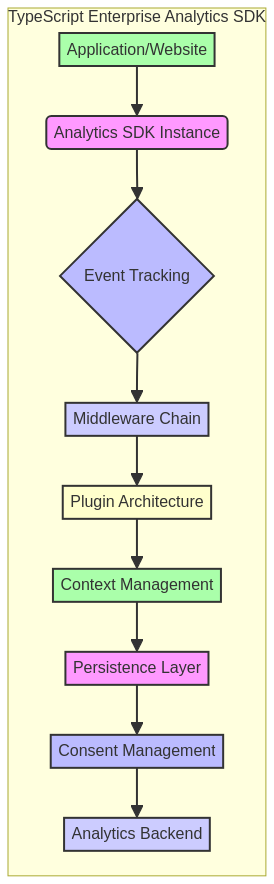

# Enterprise Analytics SDK with TypeScript


 <!-- Placeholder: Atualizar com cobertura real -->
 <!-- Placeholder: Atualizar com status de build real -->


---

## 🇧🇷 SDK de Analytics Enterprise com TypeScript

Este repositório apresenta um **Software Development Kit (SDK) robusto e escalável para analytics empresarial, desenvolvido com TypeScript**. O objetivo é fornecer um conjunto de ferramentas e componentes reutilizáveis que permitam a desenvolvedores e cientistas de dados integrar capacidades analíticas avançadas em suas aplicações web e de backend. O SDK foca em **coleta de dados, processamento, visualização e integração com plataformas de analytics**, garantindo tipagem forte, manutenibilidade e alta performance.

### 🎯 Objetivo

O principal objetivo deste projeto é **fornecer um SDK completo e bem documentado** que acelere o desenvolvimento de soluções de analytics em ambientes empresariais. Serão abordados desde a arquitetura do SDK, padrões de design, exemplos de uso em diferentes contextos (frontend e backend), até a integração com APIs de dados e ferramentas de visualização, com ênfase em **rastreamento de eventos aprimorado, suporte a middleware, arquitetura de plugins, gerenciamento de contexto, persistência e consentimento**.

### ✨ Destaques

- **Rastreamento de Eventos Aprimorado**: Mecanismos flexíveis para capturar e processar eventos de usuário e sistema, com a capacidade de adicionar propriedades customizadas e metadados ricos a cada evento.
- **Suporte a Middleware**: Uma arquitetura de middleware que permite interceptar e modificar eventos antes que sejam processados ou enviados, possibilitando validação, enriquecimento e filtragem de dados de analytics.
- **Arquitetura de Plugins Extensível**: Um sistema de plugins que facilita a integração com diversas plataformas de analytics de terceiros (e.g., Google Analytics, Mixpanel, Segment) e a adição de funcionalidades customizadas sem modificar o core do SDK.
- **Gerenciamento de Contexto e Persistência**: Funcionalidades para gerenciar o contexto do usuário e da sessão, persistindo dados importantes (como IDs de usuário e propriedades globais) entre sessões e recarregamentos de página, garantindo uma visão consistente do comportamento do usuário.
- **Gerenciamento de Consentimento**: Implementação de mecanismos para respeitar as preferências de privacidade do usuário, permitindo o controle granular sobre quais dados são coletados e processados, em conformidade com regulamentações como GDPR e LGPD.
- **Tipagem Forte com TypeScript**: Garante maior segurança, manutenibilidade e refatoração de código, reduzindo erros em tempo de desenvolvimento.
- **Modularidade e Reusabilidade**: Componentes bem definidos que podem ser facilmente integrados em diversas aplicações, promovendo a reutilização e padronização.
- **Código Profissional**: Exemplos de código bem estruturados, seguindo as melhores práticas da indústria, com foco em clareza, eficiência e documentação interna.
- **Testes Incluídos**: Módulos de código validados através de testes unitários e de integração, garantindo a correção e a robustez das implementações.

### 🚀 Benefícios do SDK em Ação

Este SDK de Analytics Enterprise com TypeScript oferece uma solução completa para as necessidades de coleta e processamento de dados analíticos. Os benefícios são demonstrados através de:

1.  **Flexibilidade na Coleta de Dados**: O rastreamento de eventos aprimorado permite que as equipes de produto e marketing definam e capturem exatamente os dados de que precisam, com a granularidade necessária para análises aprofundadas.

2.  **Qualidade e Governança de Dados**: A arquitetura de middleware e o gerenciamento de consentimento garantem que os dados coletados sejam válidos, enriquecidos e estejam em conformidade com as políticas de privacidade, melhorando a qualidade e a confiabilidade dos insights.

3.  **Extensibilidade e Integração Simplificada**: O sistema de plugins permite que o SDK se adapte facilmente a novas ferramentas de analytics ou requisitos de negócios, sem a necessidade de reescrever grandes partes do código, economizando tempo e recursos de desenvolvimento.

4.  **Experiência do Usuário Consistente**: O gerenciamento de contexto e persistência assegura que a jornada do usuário seja rastreada de forma coesa, mesmo através de múltiplas sessões, fornecendo uma visão 360º do comportamento.

5.  **Desenvolvimento Ágil e Manutenível**: A tipagem forte do TypeScript e a modularidade do código resultam em um SDK mais fácil de desenvolver, testar e manter, reduzindo a dívida técnica e acelerando a entrega de novas funcionalidades analíticas.

---

## 🇬🇧 Enterprise Analytics SDK with TypeScript

This repository presents a **robust and scalable Software Development Kit (SDK) for enterprise analytics, developed with TypeScript**. The goal is to provide a set of reusable tools and components that enable developers and data scientists to integrate advanced analytical capabilities into their web and backend applications. The SDK focuses on **data collection, processing, visualization, and integration with analytics platforms**, ensuring strong typing, maintainability, and high performance.

### 🎯 Objective

The main objective of this project is to **provide a complete and well-documented SDK** that accelerates the development of analytics solutions in enterprise environments. It will cover everything from the SDK architecture, design patterns, usage examples in different contexts (frontend and backend), to integration with data APIs and visualization tools, with an emphasis on **enhanced event tracking, middleware support, plugin architecture, context management, persistence, and consent**.

### ✨ Highlights

- **Enhanced Event Tracking**: Flexible mechanisms to capture and process user and system events, with the ability to add custom properties and rich metadata to each event.
- **Middleware Support**: A middleware architecture that allows intercepting and modifying events before they are processed or sent, enabling validation, enrichment, and filtering of analytics data.
- **Extensible Plugin Architecture**: A plugin system that facilitates integration with various third-party analytics platforms (e.g., Google Analytics, Mixpanel, Segment) and the addition of custom functionalities without modifying the SDK's core.
- **Context Management and Persistence**: Features to manage user and session context, persisting important data (like user IDs and global properties) across sessions and page reloads, ensuring a consistent view of user behavior.
- **Consent Management**: Implementation of mechanisms to respect user privacy preferences, allowing granular control over which data is collected and processed, in compliance with regulations like GDPR and LGPD.
- **Strong Typing with TypeScript**: Ensures greater safety, maintainability, and code refactoring, reducing errors during development.
- **Modularity and Reusability**: Well-defined components that can be easily integrated into various applications, promoting the reuse and standardization.
- **Professional Code**: Well-structured code examples, following industry best practices, with a focus on clarity, efficiency, and internal documentation.
- **Tests Included**: Code modules validated through unit and integration tests, ensuring the correctness and robustness of the implementations.

### 📊 Visualization



*Diagrama ilustrativo da arquitetura do SDK de Analytics Empresarial, destacando os principais módulos e o fluxo de dados.*


---

## 🛠️ Tecnologias Utilizadas / Technologies Used

| Categoria         | Tecnologia      | Descrição                                                                 |
| :---------------- | :-------------- | :------------------------------------------------------------------------ |
| **Linguagem**     | TypeScript      | Linguagem principal para o desenvolvimento do SDK, oferecendo tipagem forte. |
| **Runtime**       | Node.js         | Ambiente de execução para o SDK (backend) e ferramentas de desenvolvimento. |
| **Testes**        | Jest            | Framework de testes para garantir a robustez e a correção do SDK.         |
| **Gerenciamento de Pacotes** | npm / Yarn      | Para gerenciar dependências e scripts do projeto.                         |
| **Diagramação**   | Mermaid         | Para criação de diagramas de arquitetura e fluxo de dados no README.      |

---

## 📁 Repository Structure

```
typescript-enterprise-analytics-sdk/
├── src/           # Código fonte do SDK (módulos, componentes, utilitários)
├── examples/      # Módulos de exemplo avançados
├── data/          # Dados de exemplo e mockups para testes e demonstrações
├── images/        # Imagens e diagramas para o README e documentação
├── tests/         # Testes unitários e de integração para o SDK
├── docs/          # Documentação adicional, guias de uso e exemplos
│   └── diagrams/  # Diagramas de arquitetura e fluxo de dados
├── config/        # Arquivos de configuração (e.g., para diferentes ambientes)
├── scripts/       # Scripts utilitários para build, teste e deploy do SDK
├── package.json   # Metadados do projeto e dependências
├── tsconfig.json  # Configurações do compilador TypeScript
└── README.md      # Este arquivo
```

---

## 🚀 Getting Started

Para começar, clone o repositório e explore os diretórios `src/` e `docs/` para exemplos detalhados e instruções de uso. Certifique-se de ter as dependências necessárias instaladas.

### Pré-requisitos

- Node.js (versão LTS recomendada)
- npm ou Yarn (gerenciador de pacotes)

### Instalação

```bash
git clone https://github.com/GabrielDemetriosLafis/typescript-enterprise-analytics-sdk.git
cd typescript-enterprise-analytics-sdk

# Instalar dependências
npm install  # ou yarn install

# Compilar o TypeScript
npm run build # ou yarn build
```

### Exemplo de Uso Avançado (TypeScript)

O exemplo abaixo demonstra a inicialização do `AnalyticsSDK`, a configuração de propriedades globais, a identificação de usuários, a captura de eventos e page views, o rastreamento de erros, o gerenciamento de performance e o controle de consentimento. Este código ilustra como as funcionalidades avançadas do SDK podem ser utilizadas para coletar e gerenciar dados analíticos de forma eficaz.

Para executar o exemplo avançado, utilize o comando:

```bash
npm run demo:advanced
```

O código fonte do exemplo pode ser encontrado em [`examples/advanced-example.ts`](examples/advanced-example.ts).

```typescript
import { AnalyticsSDK } from './src/analytics-sdk';
import { ConsentStatus } from './src/consent-manager';

// Mock de uma API de dados para simular o envio de eventos
class MockAnalyticsAPI {
    private endpoint: string;

    constructor(endpoint: string) {
        this.endpoint = endpoint;
    }

    async sendEvent(event: any): Promise<void> {
        console.log(`[MockAnalyticsAPI] Enviando evento para ${this.endpoint}:`, JSON.stringify(event, null, 2));
        // Simula uma chamada de API
        return new Promise(resolve => setTimeout(resolve, 100));
    }
}

// Exemplo de uso avançado do SDK de Analytics
async function runAdvancedDemo() {
    console.log("\n==================================================");
    console.log("Demonstração Avançada do SDK de Analytics Enterprise");
    console.log("==================================================");

    // Inicializa o SDK com um nome de aplicação e uma API mock
    const mockAPI = new MockAnalyticsAPI("https://api.example.com/analytics");
    const sdk = new AnalyticsSDK("MyEnterpriseApp", mockAPI);

    // --- 1. Configurar Propriedades Globais ---
    console.log("\n--- 1. Configurando Propriedades Globais ---");
    sdk.setGlobalProperties({ environment: "development", version: "3.0.0", tenantId: "ENT987" });
    console.log("  Propriedades globais definidas: ", sdk.getGlobalProperties());

    // --- 2. Gerenciar Consentimento ---
    console.log("\n--- 2. Gerenciando Consentimento ---");
    console.log("  Status de consentimento inicial: ", sdk.getConsentStatus());
    sdk.updateConsent({
        analytics: ConsentStatus.GRANTED,
        marketing: ConsentStatus.DENIED,
        personalization: ConsentStatus.GRANTED
    });
    console.log("  Status de consentimento atualizado: ", sdk.getConsentStatus());

    // --- 3. Identificar Usuário ---
    console.log("\n--- 3. Identificando Usuário ---");
    sdk.identifyUser("adv_user_456", { email: "advanced.user@example.com", plan: "enterprise", department: "R&D" });
    console.log("  Usuário identificado: ", sdk.getCurrentUser());

    // --- 4. Capturar Eventos Personalizados ---
    console.log("\n--- 4. Capturando Eventos Personalizados ---");
    await sdk.captureEvent("dashboard_loaded", { dashboardId: "DASH001", widgetsCount: 5 });
    await sdk.captureEvent("report_generated", { reportType: "sales_summary", format: "pdf", durationMs: 1200 });
    await sdk.captureEvent("data_exported", { dataType: "customer_data", recordCount: 15000, destination: "s3" });
    console.log("  Eventos personalizados capturados.");

    // --- 5. Capturar Page Views com Metadados ---
    console.log("\n--- 5. Capturando Page Views com Metadados ---");
    await sdk.capturePageView("/app/reports/sales", { pageTitle: "Sales Report", filtersApplied: ["Q3", "2025"] });
    await sdk.capturePageView("/app/settings/profile", { pageTitle: "User Profile Settings" });
    console.log("  Page views capturadas.");

    // --- 6. Simular e Rastrear Erros Críticos ---
    console.log("\n--- 6. Simulando e Rastreando Erros Críticos ---");
    try {
        // Simular um erro de rede ou de processamento
        throw new Error("Network error: Failed to fetch data from external service");
    } catch (e: any) {
        await sdk.trackError(e, { component: "data_ingestion_service", severity: "critical", transactionId: "TXN789" });
        console.log("  Erro crítico rastreado.");
    }

    // --- 7. Rastrear Performance de Operações Específicas ---
    console.log("\n--- 7. Rastreando Performance de Operações Específicas ---");
    await sdk.trackPerformance("dashboard_render_time", 850, { dashboardType: "executive", dataPoints: 10000 });
    await sdk.trackPerformance("user_login_duration", 320, { authMethod: "oauth" });
    console.log("  Métricas de performance rastreadas.");

    // --- 8. Usar Middleware para Enriquecimento de Dados ---
    console.log("\n--- 8. Usando Middleware para Enriquecimento de Dados ---");
    sdk.use((event, next) => {
        // Adiciona um timestamp de processamento ao evento
        event.payload.processedAt = new Date().toISOString();
        console.log(`  Middleware: Evento '${event.name}' enriquecido com 'processedAt'.`);
        next(event);
    });
    await sdk.captureEvent("user_action", { action: "click", element: "save_button" });

    // --- 9. Desabilitar e Habilitar Rastreamento Dinamicamente ---
    console.log("\n--- 9. Desabilitando e Habilitando Rastreamento Dinamicamente ---");
    sdk.disableTracking();
    await sdk.captureEvent("event_while_disabled", { data: "this_should_not_be_sent" });
    console.log("  Rastreamento desabilitado. Evento 'event_while_disabled' não deve ser processado.");
    sdk.enableTracking();
    await sdk.captureEvent("event_after_enabled", { data: "this_should_be_sent" });
    console.log("  Rastreamento habilitado. Evento 'event_after_enabled' deve ser processado.");

    console.log("\n==================================================");
    console.log("Demonstração Avançada Concluída.");
    console.log("==================================================\n");
}

// Executar a demonstração
runAdvancedDemo();
```

---

## 🤝 Contribuição

Contribuições são bem-vindas! Sinta-se à vontade para abrir issues, enviar pull requests ou sugerir melhorias. Por favor, siga as diretrizes de contribuição.

---

## 📝 Licença

Este projeto está licenciado sob a Licença MIT - veja o arquivo [LICENSE](LICENSE) para detalhes.

---

**Autor:** Gabriel Demetrios Lafis  \n**Ano:** 2025

